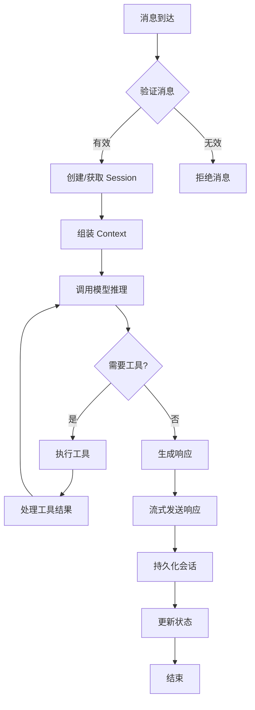

# Agent 深入理解

> 学习目标：理解 Agent Loop 工作原理

## 目录

- [Agent Loop 概述](#agent-loop-概述)
- [Loop 生命周期](#loop-生命周期)
- [消息接收](#消息接收)
- [Context 组装](#context-组装)
- [模型推理](#模型推理)
- [工具执行](#工具执行)
- [响应流式传输](#响应流式传输)
- [持久化](#持久化)
- [Loop 配置](#loop-配置)
- [小结](#小结)

---

## Agent Loop 概述

### 什么是 Agent Loop？

Agent Loop 是 OpenClaw 的核心执行引擎，它处理从接收消息到返回响应的完整流程。

### Loop 流程图

```
┌─────────────────────────────────────────────────────────────┐
│                      Agent Loop                              │
│                                                               │
│  1. 接收消息 (Message Received)                               │
│     └─ 验证、解析、预处理                                      │
│                                                               │
│  2. Context 组装 (Context Assembly)                           │
│     └─ 加载历史、系统提示、工具描述                            │
│                                                               │
│  3. 模型推理 (Model Inference)                                │
│     └─ LLM 调用、思考、决策                                   │
│                                                               │
│  4. 工具执行 (Tool Execution)                                 │
│     └─ 工具调用、结果处理、验证                               │
│                                                               │
│  5. 响应流式传输 (Response Streaming)                          │
│     └─ 实时发送、格式化、优化                                 │
│                                                               │
│  6. 持久化 (Persistence)                                      │
│     └─ 保存会话、更新状态、清理                               │
│                                                               │
└─────────────────────────────────────────────────────────────┘
```

---

## Loop 生命周期

### 完整生命周期



### 时间线

```
T0: 消息到达 Gateway
T1: 消息验证和解析 (~10ms)
T2: Session 加载/创建 (~50ms)
T3: Context 组装 (~100ms)
T4: 首次 LLM 调用 (~500-2000ms)
T5: 工具执行（如果需要）(~100-5000ms)
T6: 响应生成 (~500-1500ms)
T7: 响应发送 (~50ms)
T8: 持久化 (~100ms)

总计: 约 1.5-9 秒
```

---

## 消息接收

### 接收流程

```javascript
// 伪代码
async function receiveMessage(rawMessage) {
  // 1. 验证来源
  const validated = validateSource(rawMessage);
  if (!validated) {
    throw new Error("Unauthorized source");
  }

  // 2. 解析消息
  const parsed = parseMessage(rawMessage);

  // 3. 预处理
  const preprocessed = preprocess(parsed);

  // 4. 检查速率限制
  if (await checkRateLimit(preprocessed.user)) {
    throw new Error("Rate limit exceeded");
  }

  // 5. 检查内容安全
  const safetyCheck = await checkSafety(preprocessed.content);
  if (!safetyCheck.safe) {
    throw new Error("Content rejected");
  }

  return preprocessed;
}
```

### 消息验证

```json
{
  "messageValidation": {
    "enabled": true,
    "rules": {
      "maxLength": 10000,
      "minLength": 1,
      "allowedTypes": ["text", "image", "document"],
      "spamFilter": true,
      "contentFilter": true
    }
  }
}
```

### 消息预处理

```markdown
# AGENTS.md

## 消息预处理

### 文本清理
- 移除多余空格
- 规范化换行符
- 处理特殊字符

### 内容提取
- 从附件提取文本
- 从引用提取内容
- 从转发提取原始信息

### 上下文增强
- 识别用户意图
- 提取关键信息
- 关联相关数据
```

---

## Context 组装

### Context 结构

```typescript
interface AgentContext {
  // 系统信息
  system: {
    identity: string;      // Agent 身份
    instructions: string;   // 操作指令
    capabilities: string[]; // 能力列表
  };

  // 用户信息
  user: {
    id: string;
    name: string;
    profile: UserProfile;
    preferences: UserPreferences;
  };

  // 对话历史
  conversation: {
    messages: Message[];
    summary?: string;
    metadata: ConversationMetadata;
  };

  // 当前消息
  current: {
    content: string;
    attachments?: Attachment[];
    metadata: MessageMetadata;
  };

  // 工具信息
  tools: {
    available: Tool[];
    allowed: string[];
    denied: string[];
  };

  // 外部数据
  external?: {
    files?: FileContext[];
    searchResults?: SearchResult[];
    apiData?: Record<string, any>;
  };
}
```

### 组装顺序

```javascript
// 伪代码
async function assembleContext(session, message) {
  const context = {};

  // 1. 系统信息（优先级最高）
  context.system = {
    identity: loadFile("IDENTITY.md"),
    instructions: loadFile("AGENTS.md"),
    soul: loadFile("SOUL.md"),
    tools: loadFile("TOOLS.md"),
  };

  // 2. 用户信息
  context.user = {
    profile: loadUserProfile(message.userId),
    preferences: loadUserPreferences(message.userId),
  };

  // 3. 对话历史
  context.conversation = {
    messages: await loadRecentMessages(session.id, 20),
    summary: await loadConversationSummary(session.id),
  };

  // 4. 当前消息
  context.current = {
    content: message.content,
    attachments: message.attachments,
    metadata: message.metadata,
  };

  // 5. 工具描述
  context.tools = describeTools(session.agent.tools);

  // 6. 外部数据（可选）
  context.external = await loadExternalData(context);

  return context;
}
```

### Context 优化

```json
{
  "context": {
    "optimization": {
      "enabled": true,
      "maxHistory": 50,
      "maxTokens": 10000,
      "summarizeOld": true,
      "keepRecent": 10,
      "compression": "smart"
    }
  }
}
```

---

## 模型推理

### 推理流程

```javascript
// 伪代码
async function modelInference(context) {
  // 1. 构建提示词
  const prompt = buildPrompt(context);

  // 2. 调用 LLM
  const response = await callLLM({
    model: context.model,
    messages: prompt,
    temperature: context.temperature,
    maxTokens: context.maxTokens,
    tools: context.tools,
  });

  // 3. 解析响应
  const parsed = parseResponse(response);

  // 4. 处理思考过程（如果有）
  if (parsed.reasoning) {
    context.reasoning = parsed.reasoning;
  }

  // 5. 处理工具调用
  if (parsed.toolCalls) {
    context.toolCalls = parsed.toolCalls;
  }

  // 6. 提取最终响应
  context.response = parsed.content;

  return context;
}
```

### 提示词构建

```javascript
function buildPrompt(context) {
  const prompt = [];

  // 1. 系统提示（最高优先级）
  prompt.push({
    role: "system",
    content: `
你是 ${context.system.identity}。

${context.system.instructions}

个性特征：
${context.system.soul}

工具使用指南：
${context.system.tools}
    `.trim()
  });

  // 2. 对话历史摘要
  if (context.conversation.summary) {
    prompt.push({
      role: "system",
      content: `对话摘要：${context.conversation.summary}`
    });
  }

  // 3. 最近消息
  for (const msg of context.conversation.messages) {
    prompt.push({
      role: msg.role,
      content: msg.content
    });
  }

  // 4. 当前消息
  prompt.push({
    role: "user",
    content: context.current.content
  });

  return prompt;
}
```

### 思考过程

Claude 模型支持显示思考过程：

```markdown
# 用户消息
"帮我分析这段代码的性能问题"

# 思考过程
<thinking>
让我分析一下这个请求：

1. 用户需要代码性能分析
2. 应该先了解代码的具体功能
3. 识别潜在的性能瓶颈
4. 提供优化建议

需要使用的工具：
- read: 查看代码文件
- 如果代码很长，可能需要分段分析
</thinking>
```

---

## 工具执行

### 执行流程

```javascript
// 伪代码
async function executeTools(context) {
  const results = [];

  for (const toolCall of context.toolCalls) {
    // 1. 验证工具权限
    if (!isToolAllowed(toolCall.name, context.tools.allowed)) {
      results.push({
        id: toolCall.id,
        error: "Tool not allowed"
      });
      continue;
    }

    // 2. 执行工具
    try {
      const result = await callTool(toolCall.name, toolCall.parameters);
      results.push({
        id: toolCall.id,
        result: result
      });
    } catch (error) {
      results.push({
        id: toolCall.id,
        error: error.message
      });
    }

    // 3. 更新上下文
    context.toolResults = results;
  }

  return context;
}
```

### 工具调用循环

```
模型推理 → 工具调用 → 结果处理 → 模型推理 → 工具调用 → ...
    ↓                                              ↓
  最终响应 ←──────────────────────────────────────┘
```

### 并行执行

```json
{
  "tools": {
    "parallelExecution": {
      "enabled": true,
      "maxConcurrent": 3,
      "independentOnly": true
    }
  }
}
```

```javascript
// 并行执行独立工具
async function executeParallel(toolCalls) {
  const independent = findIndependentTools(toolCalls);
  const results = await Promise.all(
    independent.map(call => callTool(call.name, call.parameters))
  );
  return results;
}
```

---

## 响应流式传输

### 流式传输流程

```javascript
// 伪代码
async function streamResponse(context, channel) {
  // 1. 开始流
  const stream = await callLLMStream(context);

  // 2. 逐块发送
  for await (const chunk of stream) {
    // 格式化
    const formatted = formatForChannel(chunk, channel);

    // 发送
    await sendToChannel(channel, formatted);

    // 更新状态
    context.response += chunk;
  }

  // 3. 完成流
  await completeStream(channel);
}
```

### 通道适配

```javascript
function formatForChannel(content, channel) {
  switch (channel.type) {
    case 'whatsapp':
      // 无 Markdown，限制长度
      return stripMarkdown(content).substring(0, 1000);

    case 'telegram':
      // 支持 Markdown
      return content;

    case 'discord':
      // 嵌入格式
      return { embeds: [{ description: content }] };

    case 'slack':
      // Blocks 格式
      return { blocks: [{ type: 'section', text: content }] };

    default:
      return content;
  }
}
```

### 流式配置

```json
{
  "streaming": {
    "enabled": true,
    "chunkSize": 100,
    "interval": 50,
    "channels": {
      "whatsapp": false,  // WhatsApp 不支持流式
      "telegram": true,
      "discord": true,
      "slack": true
    }
  }
}
```

---

## 持久化

### 持久化内容

```typescript
interface SessionPersist {
  // 会话信息
  session: {
    id: string;
    agent: string;
    user: string;
    channel: string;
    startedAt: Date;
    updatedAt: Date;
  };

  // 消息历史
  messages: Message[];

  // 状态
  state: {
    context: any;
    variables: Record<string, any>;
    metadata: Record<string, any>;
  };

  // 统计
  stats: {
    messageCount: number;
    tokenUsage: number;
    toolCalls: number;
  };
}
```

### 持久化时机

```javascript
// 伪代码
async function persistSession(session, data) {
  const persist = {
    ...session,
    messages: session.messages.concat(data.newMessages),
    state: {
      ...session.state,
      ...data.state
    },
    stats: {
      ...session.stats,
      messageCount: session.stats.messageCount + data.messageCount,
      tokenUsage: session.stats.tokenUsage + data.tokens,
    }
  };

  await saveToFile(`sessions/${session.id}.jsonl`, persist);
}
```

### 持久化策略

```json
{
  "sessions": {
    "persistence": {
      "strategy": "immediate",  // immediate, batch, periodic
      "batchSize": 10,
      "interval": 60,
      "compression": true
    }
  }
}
```

---

## Loop 配置

### 完整配置

```json
{
  "agents": {
    "defaults": {
      "loop": {
        // 超时配置
        "timeout": {
          "inference": 30000,
          "toolExecution": 60000,
          "total": 120000
        },

        // 重试配置
        "retry": {
          "maxAttempts": 3,
          "backoff": "exponential",
          "delay": 1000
        },

        // 流式传输
        "streaming": {
          "enabled": true,
          "chunkSize": 100
        },

        // 工具执行
        "tools": {
          "parallel": true,
          "maxConcurrent": 3,
          "timeout": 30000
        },

        // Context 管理
        "context": {
          "maxHistory": 50,
          "maxTokens": 10000,
          "summarizeOld": true
        }
      }
    }
  }
}
```

### Agent 特定配置

```json
{
  "agents": {
    "list": [
      {
        "id": "fast",
        "loop": {
          "timeout": {
            "total": 60000
          },
          "streaming": {
            "enabled": true
          }
        }
      },
      {
        "id": "thorough",
        "loop": {
          "timeout": {
            "total": 300000
          },
          "tools": {
            "parallel": false,
            "maxConcurrent": 1
          }
        }
      }
    ]
  }
}
```

---

## 小结

本节我们学习了：

1. ✅ Agent Loop 概述 - 核心执行引擎
2. ✅ Loop 生命周期 - 从接收到持久化的完整流程
3. ✅ 消息接收 - 验证、解析、预处理
4. ✅ Context 组装 - 系统信息、用户信息、历史、工具
5. ✅ 模型推理 - 提示词构建、LLM 调用、响应解析
6. ✅ 工具执行 - 权限验证、并行执行、结果处理
7. ✅ 响应流式传输 - 实时发送、通道适配
8. ✅ 持久化 - 会话保存、状态更新
9. ✅ Loop 配置 - 超时、重试、流式传输、工具执行

## 下一步

[工具系统](./13-tools-system.md) - 掌握核心工具的使用
